# UX / UI 🎨

[Navigate back to README Documentation](./README.md)

My design process for the Himawari Sushi app began with the use of [Figma design tool](https://www.figma.com/). I
created designs for multiple
screen sizes, including mobile, iPad, and desktop, to ensure a seamless user experience across all devices.

To bring our design process to life, I conducted extensive research to choose the perfect colors and images for the
app. Looking at other successful restaurant apps and analyzed their use of color and imagery, as well as researched
the cultural significance of colors in Japanese cuisine.

To complement the imagery of the dishes available, I carefully selected a
color palette that would harmonize with the visual elements and create a cohesive and inviting experience for the users.
By taking the time to research and carefully choose our design elements, we were able to create an app that not only
looks beautiful, but also enhances the overall user experience.

## Colour Scheme

- `hsl(33, 100%, 57%)` used for headings, buttons, lists & hover underline effects.
- `hsl(344, 11%, 19%)` used for primary background & headings.
- `hsl(0, 1%, 40%)` used for paragraphs & secondary text.
- `hsl(0deg, 0%, 0%)` Tailwind predefined black throughout for backgrounds.

I used figma design tools to generate my colour palette.


I've used CSS `:root` variables to easily update the global colour scheme by changing only one value, instead of
everywhere in the CSS file.

> **Note**
>
> Variables prefixed with `--color-` are used in tailwind config file to generate the tailwind colour palette & are not
> prefixed with hsl() values.
> See [Tailwindcss Using CSS variables](https://tailwindcss.com/docs/customizing-colors#using-css-variables) for more
> information.

```css
:root {
    --color-orange-base: 33 100% 57%;
    --color-black-base: 344 11% 19%;
    --color-gray-base: 0 1% 40%;
    --color-gray-shadow-base: hsl(0deg, 0%, 38%);
    --color-gray-shadow-dark: hsl(0deg, 0%, 34%);
    --color-gray-shadow-light: hsl(0deg, 0%, 42%);
}
```

🔝 [Back to Top](#ux--ui-)

## Typography

I refrained from using any custom fonts for this project, opting instead for the default fonts provided by the browser.
I deemed these fonts to be the most suitable for the project.

🔝 [Back to Top](#ux--ui-)

## Icons

I've used the [icons.js library](https://icones.js.org) to find suitable icons for my project. I've used the following
icons:

> **Note**
>
> The logo icon is no longer available, a suitable link is below and the original is available in
> the `docs/design/logo.svg`
> folder. The link below is a similar icon.

create a table like below: (use the table generator)

| Name                | Image                                                                                                    | URI                                                                          |
|---------------------|----------------------------------------------------------------------------------------------------------|------------------------------------------------------------------------------|
| Logo                |                             | https://api.iconify.design/ic:sharp-ramen-dining.svg                         |
| Explore more        |      | https://api.iconify.design/mdi:arrow-right-bold-hexagon-outline.svg          |
| Book now            |      | https://api.iconify.design/material-symbols:arrow-right-alt-rounded.svg      |
| Subscribe           |                              | https://api.iconify.design/ion:paper-plane.svg                               |
| Facebook            |                              | https://api.iconify.design/ri:facebook-fill.svg                              |
| Instagram           |                                | https://api.iconify.design/mdi:instagram.svg                                 |
| Twitter             |                                    | https://api.iconify.design/mdi:twitter.svg                                   |
| Stripe              |                                                    | https://api.iconify.design/logos:stripe.svg                                  |
| Visa                |                                                        | https://api.iconify.design/logos:visa.svg                                    |
| Paypal              |                                                    | https://api.iconify.design/logos:paypal.svg                                  |
| Profile             |                | https://api.iconify.design/material-symbols:account-circle.svg               |
| Arrow down          |             | https://api.iconify.design/ic:baseline-keyboard-arrow-down.svg               |
| Log out             |                              | https://api.iconify.design/ic:twotone-logout.svg                             |
| Home                |                               | https://api.iconify.design/clarity:house-solid.svg                           |
| Booking             |  | https://api.iconify.design/material-symbols:collections-bookmark-outline.svg |
| Account information |          | https://api.iconify.design/material-symbols:settings.svg                     |

🔝[Back To Top](#ux--ui-)
## Images

I have sourced images from [Unsplash](https://unsplash.com/) and [Yosushi](https://yosushi.com/menu) for my project. I
included the image source and link in the table below.

| Creator | Image | link | Page used |
|---------|-------|------|-----------|
| [Mahhmoud Fawzy](https://unsplash.com/@mahmoud_fawzy100)  |          | [Navigate to source](https://unsplash.com/photos/n1DePkKznLY)                                                                                                                                                  | Home page \| Banner               |
| [Mahhmoud Fawzy](https://unsplash.com/@mahmoud_fawzy100)  |             | [Navigate to source](https://unsplash.com/photos/YnVaHqgpPLA)                                                                                                                                                  | Home page \| About us             |
| [Yosuhi.com](https://yosushi.com/)                        |                                                          | [Navigate to source](https://cdn.yosushi.com/r/w-630/p-webp/YoSushi/files/e1/e141914d-cf49-4e80-bcb2-9f9ffa00b218.638190109510000000.png)                                                                      | Home page \| Popular dish 1       |
| [Yosuhi.com](https://yosushi.com/)                        |                                                          | [Navigate to source](https://cdn.yosushi.com/r/w-1000/p-webp/YoSushi/files/1e/1e81f918-1a25-4f7e-9b22-a78ddb42a2ff.638190108800000000.png)                                                                     | Home page \| Popular dish 2       |
| [Yosuhi.com](https://yosushi.com/)                        |                                                        | [Navigate to source](https://cdn.yosushi.com/r/w-630/p-webp/YoSushi/files/72/72b05427-15be-4cf6-be81-829b9abf19f8.638178012430000000.png)                                                                      | Home page \| Popular dish 3       |
| [Food Photographer](https://unsplash.com/@phototastyfood) |          | [Navigate to source](https://images.unsplash.com/photo-1635526909180-87e0af34ba69?ixlib=rb-4.0.3&ixid=MnwxMjA3fDB8MHxjb2xsZWN0aW9uLXBhZ2V8MTB8Mjc2cHV5VUpYRzB8fGVufDB8fHx8&auto=format&fit=crop&w=1400&q=60)   | Home page \| Newly added          |
| [Yosuhi.com](https://yosushi.com/)                        |                                                             | [Navigate to source](https://cdn.yosushi.com/r/w-630/p-webp/YoSushi/files/4e/4e0b4b5a-0b0a-4b0e-9b0a-5b8b8b2b2b2b.638178012430000000.png)                                                                      | Home page \| Newsletter           |
| [Thomas Marban](https://unsplash.com/@thomas)             |           | [Navigate to source](https://images.unsplash.com/photo-1502364271109-0a9a75a2a9df?ixlib=rb-4.0.3&ixid=MnwxMjA3fDB8MHxjb2xsZWN0aW9uLXBhZ2V8MXwyNzZwdXlVSlhHMHx8ZW58MHx8fHw%3D&auto=format&fit=crop&w=1000&q=60) | About us page   \| Banner image 1 |
| [The Free Birds](https://unsplash.com/@thefreebirds)      |           | [Navigate to source](https://images.unsplash.com/photo-1607857531051-154c0e9cb36f?ixlib=rb-4.0.3&ixid=MnwxMjA3fDB8MHxjb2xsZWN0aW9uLXBhZ2V8MXwyNzZwdXlVSlhHMHx8ZW58MHx8fHw%3D&auto=format&fit=crop&w=1000&q=60) | About us page   \| Banner image 2 |
| [Niki Mitra](https://unsplash.com/@nikhilmitra)           |           | [Navigate to source](https://images.unsplash.com/photo-1595542341890-8162783c34a8?ixlib=rb-4.0.3&ixid=MnwxMjA3fDB8MHxjb2xsZWN0aW9uLXBhZ2V8OXwyNzZwdXlVSlhHMHx8ZW58MHx8fHw%3D&auto=format&fit=crop&w=1000&q=60) | About us page   \| Banner image 3 |
| [Thomas Marban](https://unsplash.com/@thomas)             |      | [Navigate to source](https://images.unsplash.com/photo-1502364271109-0a9a75a2a9df?ixlib=rb-4.0.3&ixid=MnwxMjA3fDB8MHxjb2xsZWN0aW9uLXBhZ2V8MnwyNzZwdXlVSlhHMHx8ZW58MHx8fHw%3D&auto=format&fit=crop&w=1000&q=60) | About us page   \| Team member 1  |
| [ABDALLA M](https://unsplash.com/@abdallam)               |      | [Navigate to source](https://images.unsplash.com/photo-1619127839672-f82155f659a6?ixlib=rb-4.0.3&ixid=MnwxMjA3fDB8MHxjb2xsZWN0aW9uLXBhZ2V8N3wyNzZwdXlVSlhHMHx8ZW58MHx8fHw%3D&auto=format&fit=crop&w=1000&q=60) | About us page   \| Team member 2  |
| [John Forander](https://unsplash.com/@johnfo)             |      | [Navigate to source](https://images.unsplash.com/photo-1595257841889-eca2678454e2?ixlib=rb-4.0.3&ixid=MnwxMjA3fDB8MHxjb2xsZWN0aW9uLXBhZ2V8NnwyNzZwdXlVSlhHMHx8ZW58MHx8fHw%3D&auto=format&fit=crop&w=1000&q=60) | About us page   \| Team member 3  |
| [Dilara Yilmaz](https://unsplash.com/@dylara)             |           | [Navigate to source](https://images.unsplash.com/photo-1561466273-c13f88329aa0?ixlib=rb-4.0.3&ixid=MnwxMjA3fDB8MHxjb2xsZWN0aW9uLXBhZ2V8OHwyNzZwdXlVSlhHMHx8ZW58MHx8fHw%3D&auto=format&fit=crop&w=1400&q=60)    | Menu page \| banner               |
| [Wyron A](https://unsplash.com/@wyron)                    |  | [Navigate to source](https://images.unsplash.com/photo-1522701025355-3b334358d451?ixlib=rb-4.0.3&ixid=MnwxMjA3fDB8MHxjb2xsZWN0aW9uLXBhZ2V8M3wyNzZwdXlVSlhHMHx8ZW58MHx8fHw%3D&auto=format&fit=crop&w=1000&q=60) | Subscribe success page \| banner  |

🔝 [Back To Top](#ux--ui-)

## High fidelity design mockups

To follow best practice, high fidelity mockups were developed for mobile, tablet, and desktop sizes.
I've used [Figma](https://www.figma.com/) to design my site mockups. Figma is a vector graphics editor and
prototyping.The Figma design file is available in the `docs/design/figma/django-sushi.fig` folder.

> **Note**
>
> Some pages did not require a desktop mockup, as the design was the same as the tablet mockup.

Mockups by page:

- [About page](#about-page)
- [Contact page](#contact-page)
- [Create booking page | user logged in](#create-booking-page-logged-in)
- [Create booking page | user logged out](#create-booking-page-logged-out)
- [FAQ page](#faq-page)
- [Home page](#home-pages)
- [Login page](#login-page)
- [Menu page](#menu-page)
- [Profile dashboard page](#profile-dashboard-page)
- [Profile details page](#profile-details-page)
- [Profile edit booking page](#profile-edit-booking-page)
- [Register page](#register-page)
- [Subscribe success page](#subscribe-success-page)

### About page

<details>
<summary>Mobile</summary>


</details>

<details>
<summary>Tablet</summary>


</details>

<details>
<summary>Desktop</summary>


</details>

### Contact page

<details>
<summary>Mobile</summary>


</details>

<details>
<summary>Tablet</summary>


</details>

### Create booking page logged in

<details>
<summary>Mobile</summary>

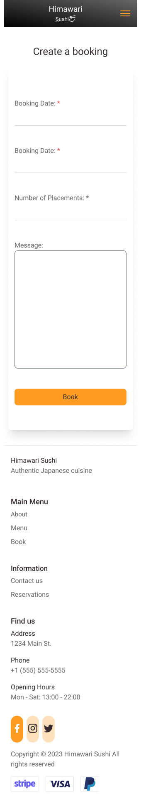

</details>

<details>
<summary>Tablet</summary>


</details>

### Create booking page logged out

<details>
<summary>Mobile</summary>

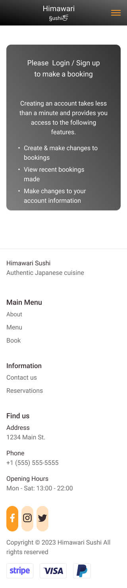

</details>

<details>
<summary>Tablet</summary>

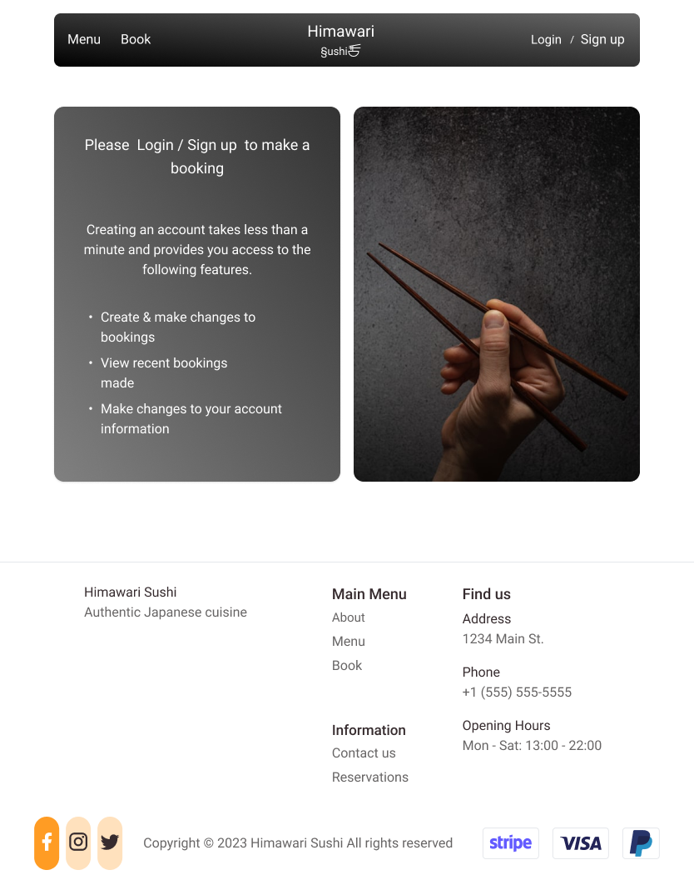

</details>

### FAQ page

<details>
<summary>Mobile</summary>

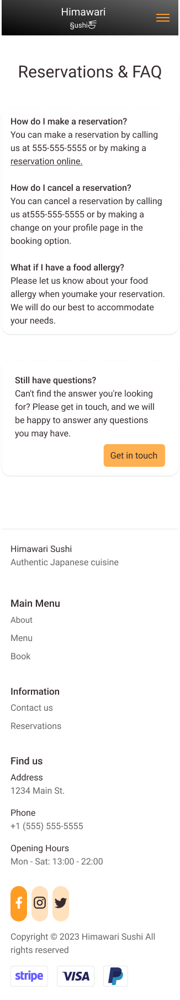

</details>

<details>
<summary>Tablet</summary>


</details>

### Home pages

<details>
<summary>Mobile</summary>

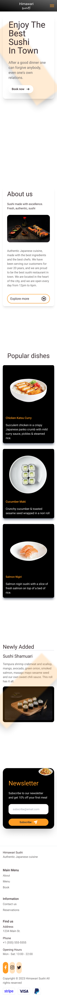

</details>

<details>
<summary>Mobile with menu open</summary>


</details>


<details>
<summary>Tablet</summary>

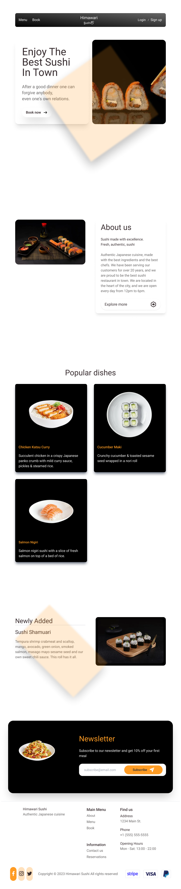

</details>

<details>
<summary>Desktop</summary>

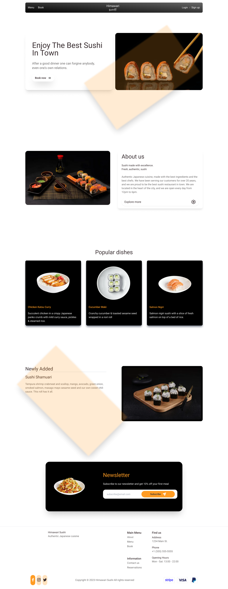

</details>

### Login page

<details>
<summary>Mobile</summary>

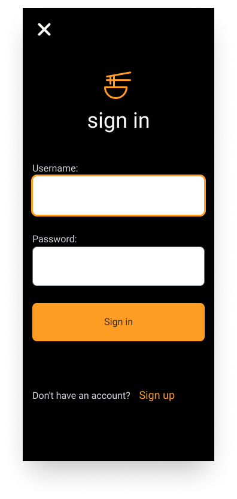

</details>

<details>
<summary>Tablet</summary>


</details>

### Menu page

<details>
<summary>Mobile</summary>


</details>

<details>
<summary>Tablet</summary>

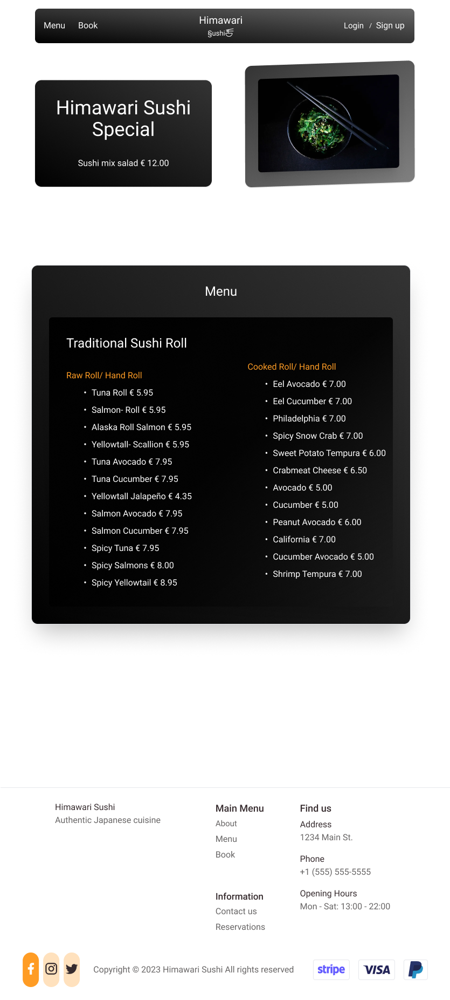

</details>

### Profile dashboard page

<details>
<summary>Mobile</summary>

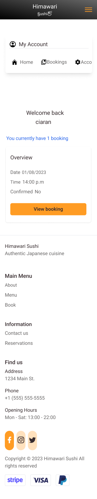

</details>

<details>
<summary>Tablet</summary>

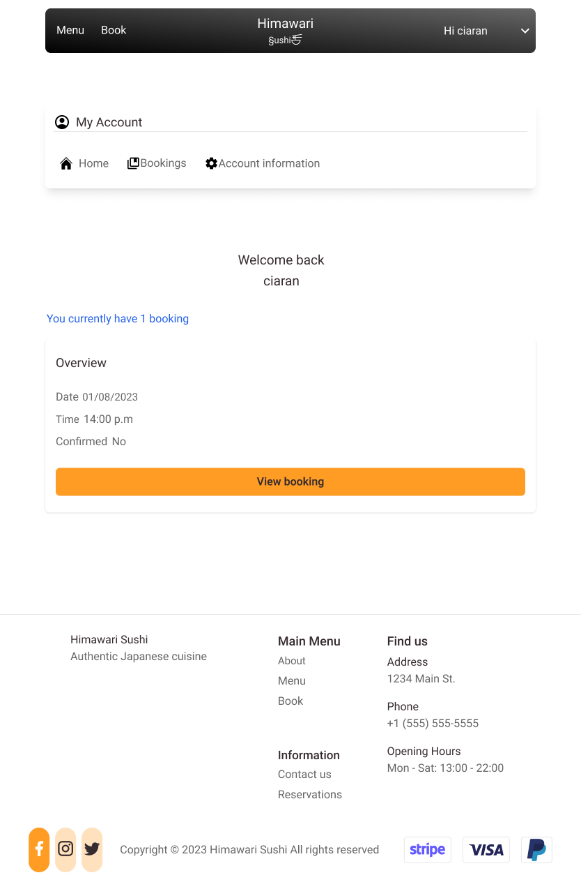

</details>

### Profile details page

<details>
<summary>Mobile</summary>


</details>

<details>

<summary>Tablet</summary>


</details>

### Profile edit booking page

<details>
<summary>Mobile</summary>


</details>

<details>

<summary>Tablet</summary>

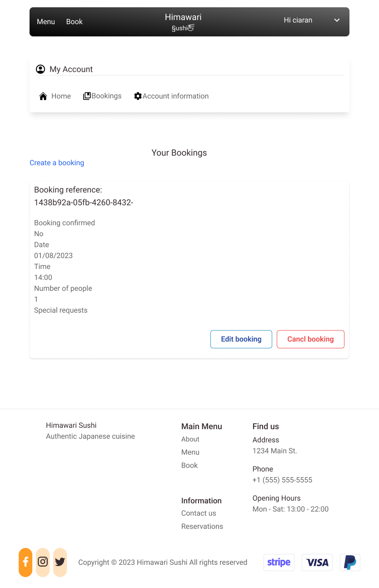

</details>

### Register page

<details>
<summary>Mobile</summary>


</details>

<details>
<summary>Tablet</summary>


</details>

### Subscribe success page

<details>
<summary>Mobile</summary>


</details>

<details>
<summary>Tablet</summary>

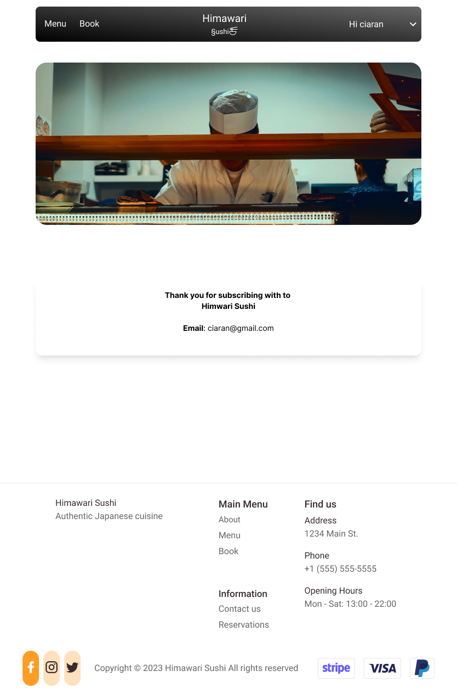

</details>

🔝 [Back To Top](#ux--ui-)
