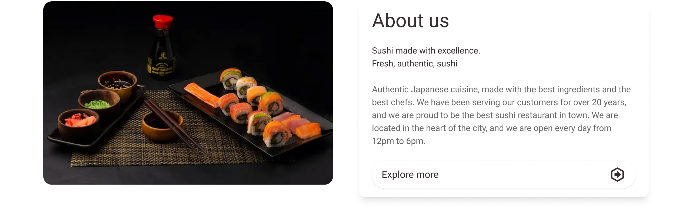

# Features ✨

[Navigate back to README Documentation](./README.md)

The features documentation is a detailed explanation of the features and functionality of the website.
It includes screenshots of the website. The features documentation is intended to be a comprehensive guide to the
website, and should be used as a reference for anyone who wants to learn more about the website. The feature
documentation is divided into sections, each of which covers a different aspect of the website. The sections are as
follows:

- [Existing Features](#existing-features)
- [Future Features](#future-features)

## Existing features:

### 🔑 Key features:

- User authentication and authorisation
- User profile management
- CRUD operations for booking management
- Responsive design for mobile and desktop devices
- Robust error handling and validation
- Defensive programming to prevent unauthorized access to protected pages
- Custom error pages

### Supporting features:

#### **About us**

- The about section provides users with information about the restaurant, including the restaurant’s history, with a
  link to the about us page for further information. This feature provides value to users by giving them quick and easy
  access to important information about the restaurant.

  

  
📸 Preview

  

  

#