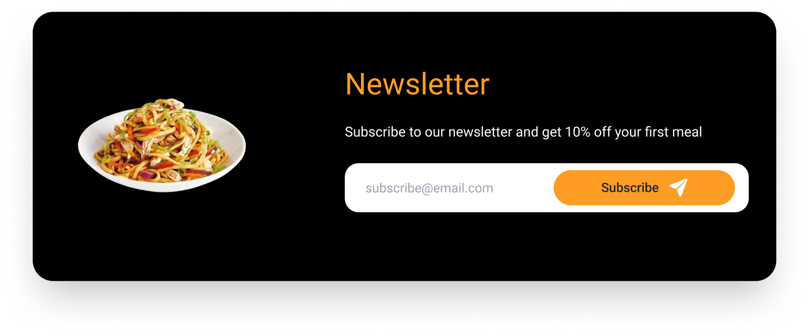
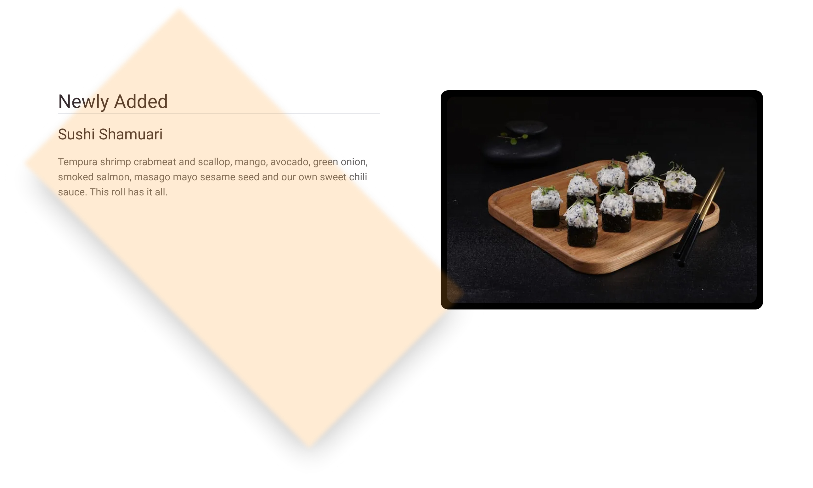

# Features ✨

[Navigate back to README Documentation](./README.md)

The features documentation is a detailed explanation of the features and functionality of the website.
It includes screenshots of the website. The features documentation is intended to be a comprehensive guide to the
website, and should be used as a reference for anyone who wants to learn more about the website. The feature
documentation is divided into sections, each of which covers a different aspect of the website. The sections are as
follows:

- [Existing Features](#existing-features)
- [Future Features](#future-features)

## Existing features:

### 🔑 Key features:

- User authentication and authorisation
- User profile management
- CRUD operations for booking management
- Responsive design for mobile and desktop devices
- Robust error handling and validation
- Defensive programming to prevent unauthorized access to protected pages
- Custom error pages

### Supporting features:

#### **About us**

- The about section provides users with information about the restaurant, including the restaurant’s history, with a
  link to the about us page for further information. This feature provides value to users by giving them quick and easy
  access to important information about the restaurant.

  <details open>

  <summary>📸 Preview</summary>

  

  </details>

#### **Bookings**

- > **Note**
  >
  > The booking feature is only available to authenticated users. Login / Sign links are provided to allow users to
  create an account and login.

- Customers can reserve tables for dine-in service with ease, specifying the date and time, party size, and any
  special requests. This feature offers value to users, as it eliminates the need to visit in person or make a phone
  call.

  <details>

  <summary>📸 Preview booking page logged in</summary>

  
  </details>

  <details>

  <summary>📸 Preview booking page logged out</summary>

  

   </details>

#### **Booking edit / delete middleware**

- The booking middleware feature is used to prevent unauthorized access to the booking edit and delete pages. This
  feature provides value to users by preventing them from editing or deleting bookings that are not theirs.

```python

class BookingMiddleware:
    # A middleware class to check if a user is
    # trying to edit a booking that is not theirs
    def __init__(self, get_response):
        self.get_response = get_response
        # One-time configuration and initialization.

    def __call__(self, request):
        # Code to be executed for each request before
        # the view (and later middleware) are called.
        response = self.get_response(request)
        # Code to be executed for each request/response after
        # the view is called.
        return response

    def process_view(self, request, view_func, view_args, view_kwargs):
        # Code to be executed for each request before
        # the view (and later middleware) are called.

        if request.path.startswith('/booking/edit/')
            or request.path.startswith('/booking/delete/'):

        if not request.user.is_authenticated:
            messages.error(request,
                           'You must be logged in to edit a booking.')
            return redirect(reverse('login'))

        booking_id = view_kwargs['pk']
        # return 404 if booking_id does not exist not valid uuid
        try:
            uuid.UUID(booking_id)
        except ValueError:
            raise Http404

        booking = get_object_or_404(Booking, pk=booking_id)
        user = User.objects.get(username=request.user)

        if booking.customer_id != user.id:
            messages.error(request,
                           'You do not have permission'
                           ' to edit this booking.')
            return redirect(reverse('profile-bookings'))

    return None

```

#### **Contact form**

- The contact form provides users with a way to get in touch with the restaurant, whether it be to ask a question,
  make a suggestion, or provide feedback. This feature provides value to users by allowing them to easily
  communicate with the restaurant without having to visit in person or make a phone call.

  <details> 

  <summary>📸 Preview</summary>

  

  </details>

#### **Contact information**

- Provide the restaurant’s address, phone number, email, and hours of operation.
  This feature provides value to users by giving them quick and easy access to important information about the
  restaurant.

  <details open>

  <summary>📸 Preview</summary>

  

  </details>

#### **FAQ**

- The Frequently Asked Questions (FAQ) page provides answers to commonly asked inquiries regarding the booking /
  cancellation process, & a link to the contact page for further assistance. This feature provides value to users by
  giving them quick and easy access to important information about the restaurant.

  <details>

  <summary>📸 Preview</summary>

  

  </details>

#### **Navigation bar**

- The navigation bar provides users with a way to navigate between the different pages of the website. This feature
  provides value to users by allowing them to easily find what they are looking for without having to scroll through
  all the content on each page.

  <details open>

  <summary>📸 Preview</summary>

  

  </details>

#### **Newsletter Signup**

- The newsletter signup feature allows users to subscribe to the restaurant’s email newsletter, which provides
  updates on new menu items, special events, and promotions. This feature provides value to users by giving them a
  way to stay informed about the restaurant’s offerings and potentially save money on their next visit.

  <details open>

  <summary>📸 Preview</summary>

  

  </details>

#### **Restaurant menu**

- The menu page provides value to users by displaying the various dishes offered by the restaurant, along with their
  prices, enabling them to easily browse and make informed decisions about their order.

  <details>

  <summary>📸 Preview</summary>

  
  </details>

#### **Responsive mobile menu**

- The mobile menu provides users with a way to navigate the site on smaller screens. This feature provides value to
  users by giving them quick and easy access to signing in and registering a new account as well as viewing the menu
  and make a booking.

  <details>

  <summary>📸 Preview</summary>

  
  </details>

#### **Social media integration**

- Provide links to the restaurant’s social media accounts (Facebook, Twitter, Instagram, etc.).
  This feature provides value to users by giving them quick and easy access to important information about the
  restaurant.
- > **Note**
  >
  > The social media links do not link to actual accounts, they navigate to the social provider home page.

  <details>

  <summary>📸 Preview</summary>

  
  </details>

#### **Popular Dishes**

- The popular dishes section provides value to users by displaying the most popular dishes offered by the restaurant,
  enabling them to easily browse and make informed decisions about their order.

  <details open>
  <summary>📸 Preview</summary>

  
  </details>

#### **Newly added dishes**

- The newly added dishes section is a great benefit to customers, as it showcases the most recent dishes offered by
  the restaurant, providing an incentive to come back & attract new potential customers.

  <details open>

  <summary>📸 Preview</summary>

  

  </details>

#### **Account Login**

- Allows users to sign in to their account, which provides them with access to their profile page,
  where they can view their booking history and update their account information. This feature provides value to users
  by giving them a way to manage their bookings and account information.

  <details>

  <summary>📸 Preview</summary>

  

  </details>

#### **Account Registration**

- Allows users to create an account, which provides them with access to their profile page,
  where they can view their booking history and update their account information. This feature provides value to users
  by giving them a way to manage their bookings and account information.

  <details>
  <summary>📸 Preview</summary>

  
  </details>

#### **Profile Dashboard**

- The profile page allows users to view their booking history and update their account information. This feature
  provides value to users by giving them a way to manage their bookings and account information.

  <details>
  <summary>📸 Preview</summary>

  
  </details>

#### **Profile user bookings**

- The profile page allows users to view their booking history and update their account information. This feature
  provides value to users by giving them a way to manage their bookings and account information.

  <details>
  <summary>📸 Preview</summary>

  
  </details>

#### **Profile user account information**

- The account information section of the profile page allows users to update their account information. This feature
  provides value to users by giving them a way to manage their account information.

  <details>
  <summary>📸 Preview</summary>

  
  </details>

##### **Profile middleware**

- The profile middleware prevents non-authenticated users from accessing the profile accounts pages. This feature will
  redirect the user to the login page if they are not authenticated.
- > **Note**
  >
  >The profile middleware is a custom middleware class that is registered in the project settings.py file.
  > The middleware class is called on every request and checks if the user is authenticated. If the user is not
  > authenticated and the request path starts with /profile, the user is redirected to the login page.

```python
class LoginMiddleware:
    def __init__(self, get_response):
        self.get_response = get_response

    def __call__(self, request):
        response = self.get_response(request)
        return response

    def process_view(self, request, view_func, view_args, view_kwargs):
        # Prevent non-authenticated users from accessing the profile page
        if request.path.startswith('/profile'):
            if not request.user.is_authenticated:
                return redirect(settings.LOGIN_URL)
        else:
            return None
```

[🔝 Back to Top](#features-)

## 🔮Future features:

- **Allow guest booking**
  - Currently, only authenticated users can make a booking.
  - This feature would be implemented by adding a guest booking form to the booking page, which would allow users to
    make a booking without having to register an account.

    
- **Add navigation back to profile page when editing a booking**
  - Currently, when a user is editing a booking, there is no way to quickly navigate back to the profile page if the user
    does not want to make changes.
  - This feature would be implemented by adding a back button to the edit booking page, which would navigate the user
    back to the profile page.


- **Complete subscription integration**
  - Currently, when a user subscribes to the newsletter, their email address is not added to the database, and they do
    not receive a confirmation email.
  - Possible solution:
    - Add a newsletter subscription form to the footer of the website.
    - When a user subscribes to the newsletter, their email address is added to the database.
    - When a user subscribes to the newsletter, they receive a confirmation email.
    - When a user unsubscribes from the newsletter, their email address is removed from the database.
    - When a user unsubscribes from the newsletter, they receive a confirmation email.
    - Use the Mailchimp API to manage the newsletter subscription list.

    
- **Email confirmation for bookings & booking changes**
  - Currently, when a user makes a booking or changes a booking, there is no email confirmation sent to the user.
  - This feature would be implemented by adding a send email function to the booking views.py file, which would email
    the user when a booking is made or changed.


- **Email confirmation for account registration**
  - Currently, when a user registers an account, there is no email confirmation sent to the user.
  - This feature would be implemented by adding a send email function to the registration views.py file, which would
    email the user when an account is registered.
  - Also provide additional security by requiring the user to confirm their email address before they can log in.


- **Reset password**
  - Currently, there is no way for users to reset their password if they forget it.
  - This feature would be implemented by adding a reset password form to the login page, which would allow users to
    reset their password if they forget it.


- **Sort / filter bookings**
  - The ability to sort bookings by date would be a great feature to add to the profile page.
  - This would allow users to easily find bookings by date, which would be useful for users who have a lot of bookings.
  - This feature would be implemented by adding a filter form to the profile page, which would allow sort bookings by:
    - Past bookings
    - Upcoming bookings
    - All bookings
    - Bookings by date

🔝 [Back to Top](#features-)