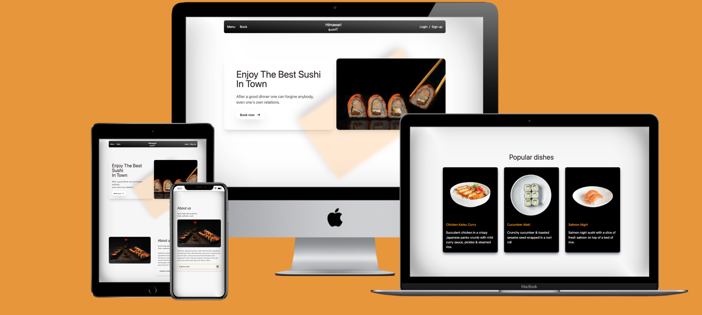

# Himawari sushi 

Looking for delicious and authentic Japanese food? Look no further than Himawari Sushi! Our restaurant is open Monday
through Saturday from 1pm to 10pm, and with our convenient app, you can easily make reservations for your next visit.
Come experience the taste of authentic Japanese cuisine at Himawari Sushi.

Himawari Sushi, is where authentic Japanese cuisine meets modern convenience. You can view our most popular dishes &
sign up for our newsletter for a discount on your next meal. Join us for a culinary journey through Japan and experience
the best of what Himawari Sushi has to offer.

## User Stories 📜

### New Site Users

| User Story               | As a new site user, I would like to...     | So that I can...                        | GitHub Issue                                                                                                                     | status |
|--------------------------|--------------------------------------------|-----------------------------------------|----------------------------------------------------------------------------------------------------------------------------------|--------|
| Account registration     | register an account                        | make a booking                          | [issue](https://github.com/users/ciaran-io/projects/2?pane=issue&itemId=25317687)                                                | ✅      |
| View restaurant menu     | view the a list of foods served            | I know what food is available           | [issue](https://github.com/users/ciaran-io/projects/2?pane=issue&itemId=25144110)                                                | ✅      |
| Contact customer support | contact customer support                   | get help with any issues or questions   | [issue](https://github.com/users/ciaran-io/projects/2?pane=issue&itemId=25317462)                                                | ❌      |
| FAQ page                 | have access to a comprehensive FAQ section | ind and answer to a question I may have | [issue](https://github.com/users/ciaran-io/projects/2/views/1?filterQuery=assignee%3A%22ciaran-io%22&pane=issue&itemId=26379445) | ✅      |

### Returning Site Users

| User Story              | As a returning site user, I would like to       | So that I can                           | GitHub Issue                                                                                                                     | status |
|-------------------------|-------------------------------------------------|-----------------------------------------|----------------------------------------------------------------------------------------------------------------------------------|--------|
| Account login           | login to my account                             | view my information & bookings          | [issue](https://github.com/users/ciaran-io/projects/2/views/1?filterQuery=assignee%3A%22ciaran-io%22&pane=issue&itemId=26214886) | ✅      |
| Manage booking details  | manage my bookings                              | make changes or cancel my booking       | [issue](https://github.com/users/ciaran-io/projects/2/views/1?filterQuery=assignee%3A%22ciaran-io%22&pane=issue&itemId=25317770) | ✅      |
| Manage account details  | manage my bookings                              | make changes to my personal information | [issue](https://github.com/users/ciaran-io/projects/2?pane=issue&itemId=25317809)                                                | ✅      |
| View booking history    | view my booking history                         | see my previous bookings                | [issue](https://github.com/users/ciaran-io/projects/2?pane=issue&itemId=27354815)                                                | ✅      |
| Newsletter subscription | sign up to the newsletter                       | I can receive offers                    | [issue](https://github.com/users/ciaran-io/projects/2?pane=issue&itemId=25317838)                                                | ❌      |
| Booking pagination      | navigate through my bookings                    | it will be easier to find my bookings   | [issue](https://github.com/users/ciaran-io/projects/2?pane=issue&itemId=26379450)                                                | ❌      |
| Allow guest bookings    | create a booking without registering an account | it would be easier to make a booking    | [issue](https://github.com/users/ciaran-io/projects/2?pane=issue&itemId=26379610)                                                | ❌      |                                                                                                                    

### Site Admin

| User Story                                             | As a site admin, I would like to                       | So that I can                                  | GitHub Issue                                                                      | status |
|--------------------------------------------------------|--------------------------------------------------------|------------------------------------------------|-----------------------------------------------------------------------------------|--------|
| Manage bookings                                        | manage customer bookings                               | add, edit or remove customer bookings          | [issue](https://github.com/users/ciaran-io/projects/2?pane=issue&itemId=25317858) | ✅      |
| Manage customers                                       | manage customer details                                | add, edit or remove customers                  | [issue](https://github.com/users/ciaran-io/projects/2?pane=issue&itemId=25317890) | ✅      |
| Email customer with booking creation / changes details | I can notify my customers in relation to their booking | the customer receives updates on their booking | [issue](https://github.com/users/ciaran-io/projects/2?pane=issue&itemId=26379452) | ❌      |
