# Testing 🧪

Return back to the [README.md](README.md) file.

## Code Validation

### HTML

I have used the recommended [HTML W3C Validator](https://validator.w3.org) to validate all of my HTML files.
Some pages require a user to be logged-in and authenticated, in order to view the page. so I have used the
[validate by input](https://validator.w3.org/#validate_by_input) method, which requires you to copy/paste
the entire HTML code into the validator.

Pages that have (validate by input) next to them, require you to copy/paste the entire HTML code into the validator.

| Page                                    | W3C URL                                                                                     | Screenshot                                                                    | Notes     |
|-----------------------------------------|---------------------------------------------------------------------------------------------|-------------------------------------------------------------------------------|-----------|
| About                                   | [W3C](https://validator.w3.org/nu/?doc=https://himawari-sushi.herokuapp.com/about)          | 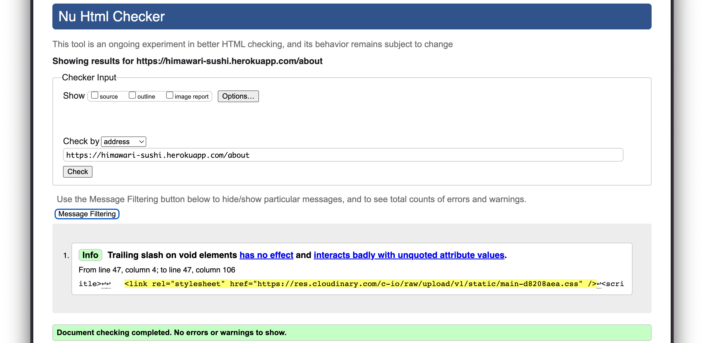                    | No errors |
| Contact                                 | [W3C](https://validator.w3.org/nu/?doc=https://himawari-sushi.herokuapp.com/contact)        | 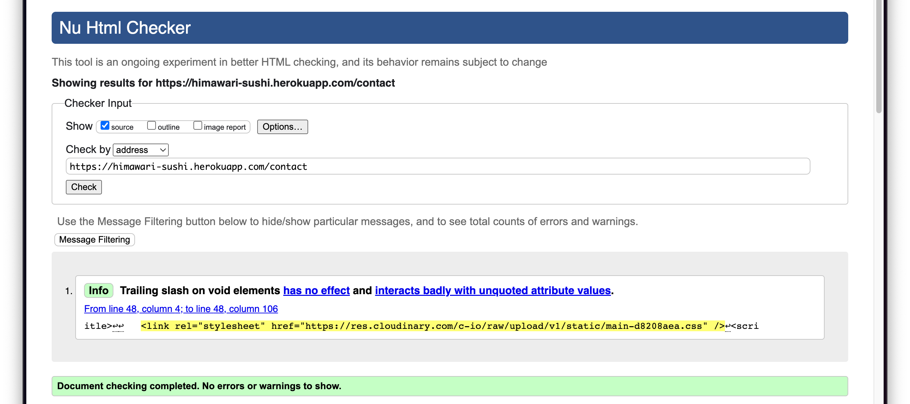                  | No errors |
| Contact form success(validate by input) | [W3C](https://validator.w3.org/nu/?doc=https://himawari-sushi.herokuapp.com/contact)        | 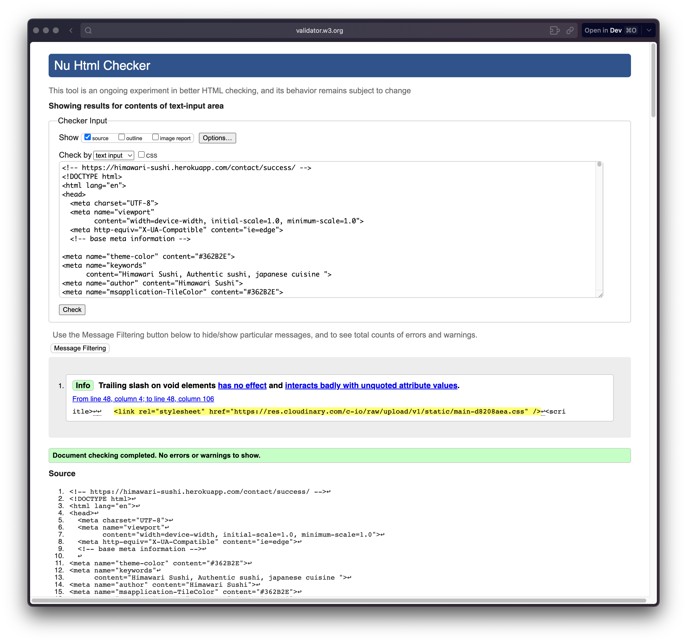          | No errors |
| Create booking(validate by input)       | [W3C](https://himawari-sushi.herokuapp.com/nu/#textarea)                                    | 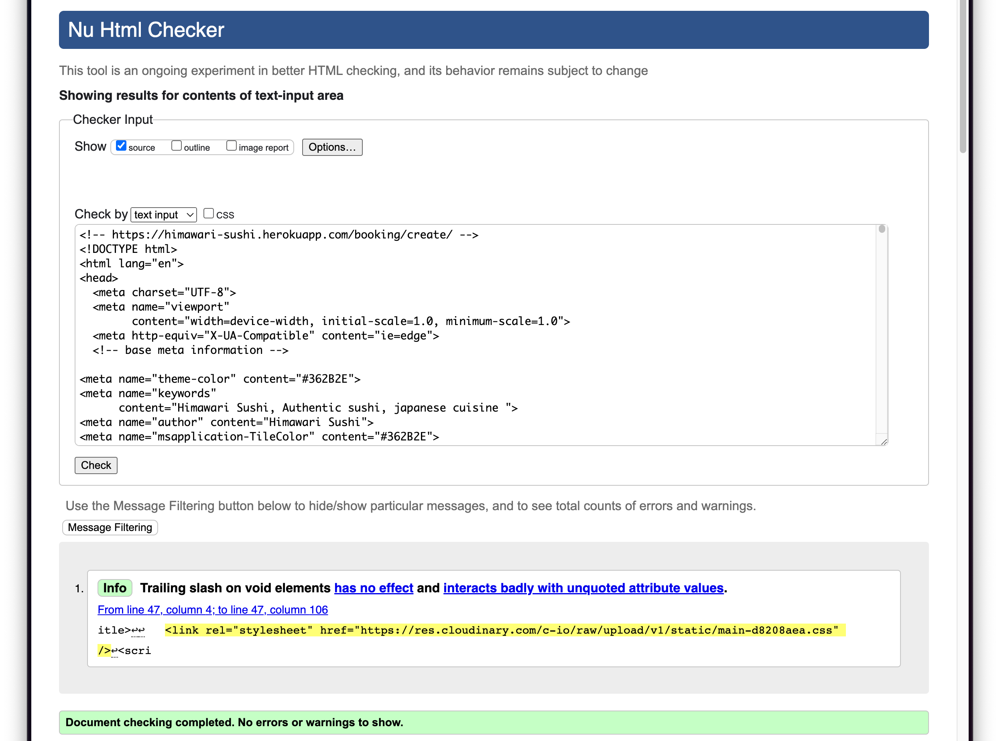 | No errors | 
| Create booking (logged out)             | [W3C](https://validator.w3.org/nu/?doc=https://himawari-sushi.herokuapp.com/booking/create) | 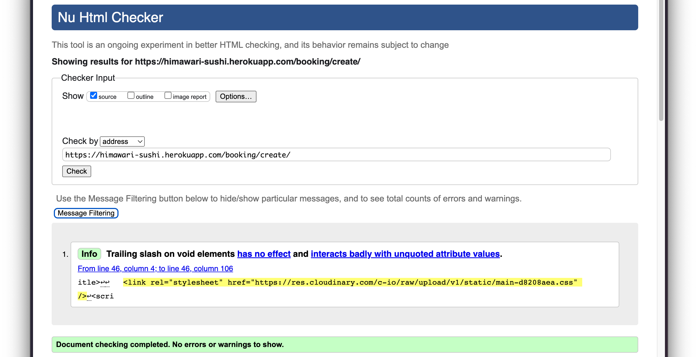           | No errors |
| Home                                    | [W3C](https://validator.w3.org/nu/?doc=https://himawari-sushi.herokuapp.com/)               |                      | No errors |
| Menu                                    | [W3C](https://validator.w3.org/nu/?doc=https://himawari-sushi.herokuapp.com/menu)           | 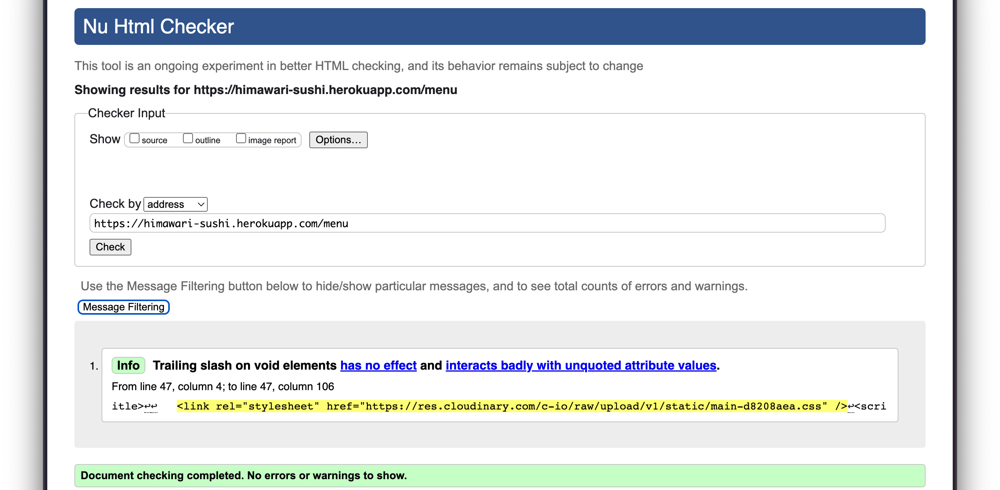                     | No errors |
| Register                                | [W3C](https://validator.w3.org/nu/?doc=https://himawari-sushi.herokuapp.com/register)       | 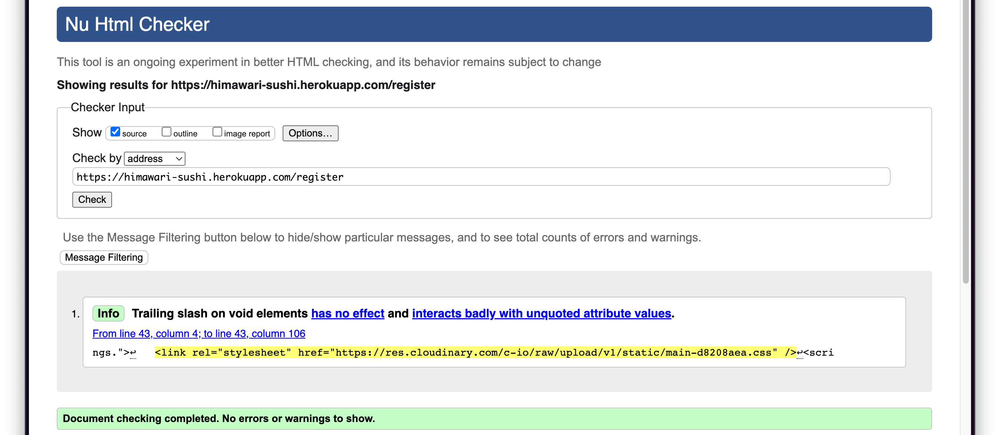                 | No errors |
| Login                                   | [W3C](https://validator.w3.org/nu/?doc=https://himawari-sushi.herokuapp.com/login)          | 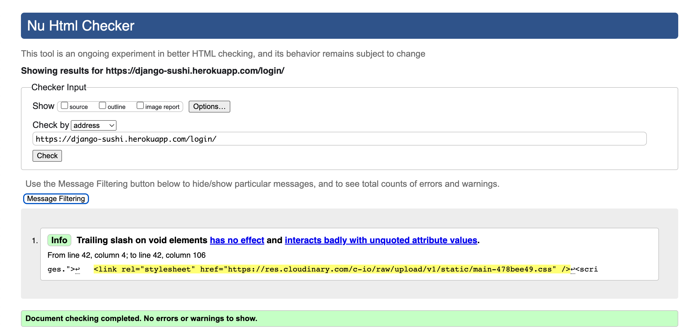                    | No errors |
| Profile(validate by input)              | [W3C](https://validator.w3.org/nu/?doc=https://himawari-sushi.herokuapp.com/#textarea)      | 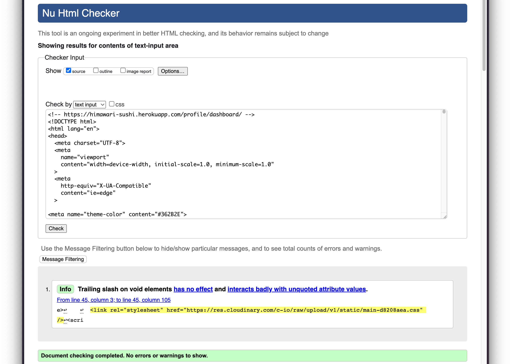        | No errors |
| Profile details(validate by input)      | [W3C](https://validator.w3.org/nu/?doc=https://himawari-sushi.herokuapp.com/#textarea)      | 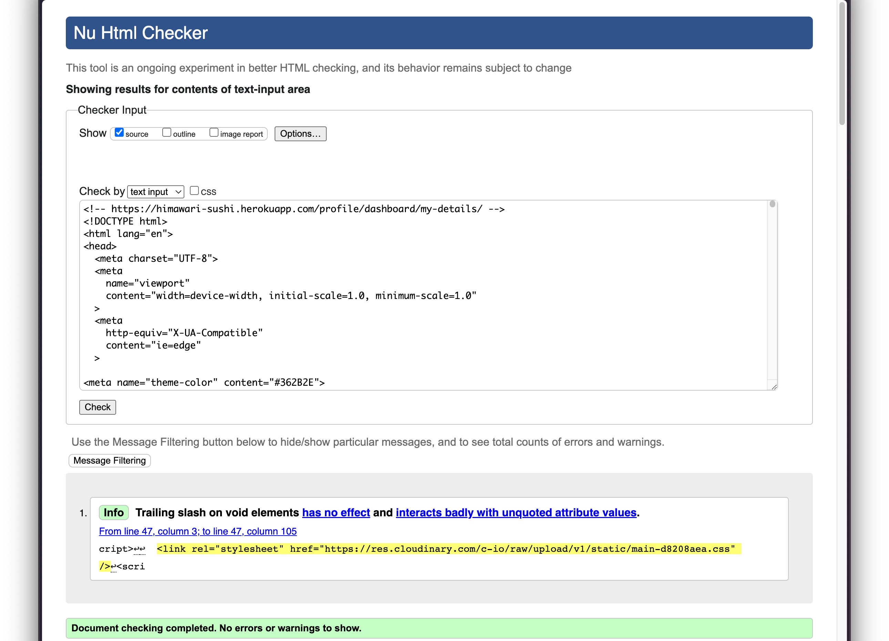          | No errors |
| Profile bookings(validate by input)     | [W3C](https://validator.w3.org/nu/?doc=https://himawari-sushi.herokuapp.com/#textarea)      |          | No errors |
| Reservations                            | [W3C](https://validator.w3.org/nu/?doc=https://himawari-sushi.herokuapp.com/reservations)   | 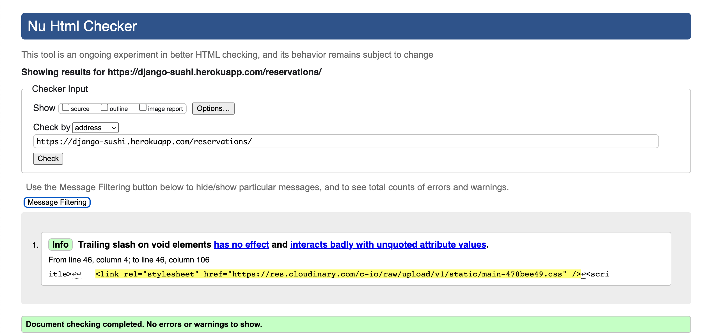             | No errors |
| Subscribe success(validate by input)    | [W3C](https://validator.w3.org/nu/?doc=https://himawari-sushi.herokuapp.com/#textarea)      | 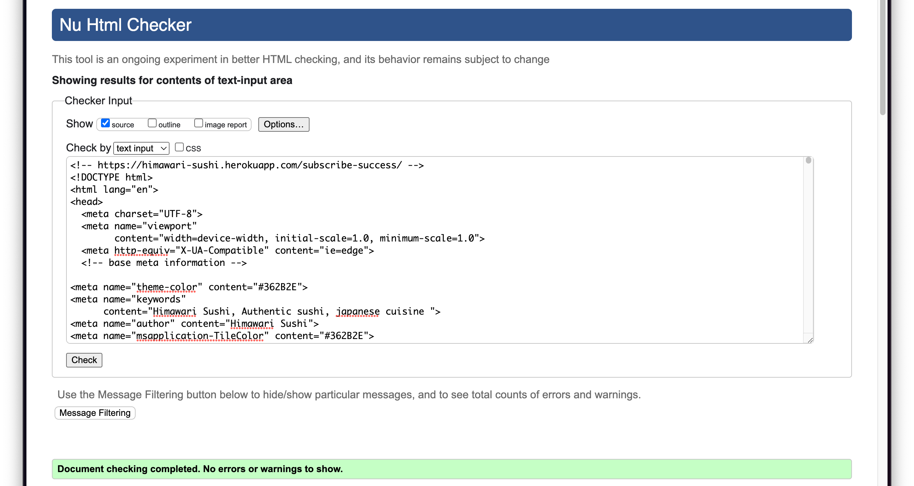        | No errors |
| Subscribe success (validate by input)   | [W3C](https://validator.w3.org/nu/?doc=https://himawari-sushi.herokuapp.com/#textarea)      |         | No errors |
| Error 404 (validate by input)           | [W3C](https://validator.w3.org/nu/?doc=https://himawari-sushi.herokuapp.com/#textarea)      | 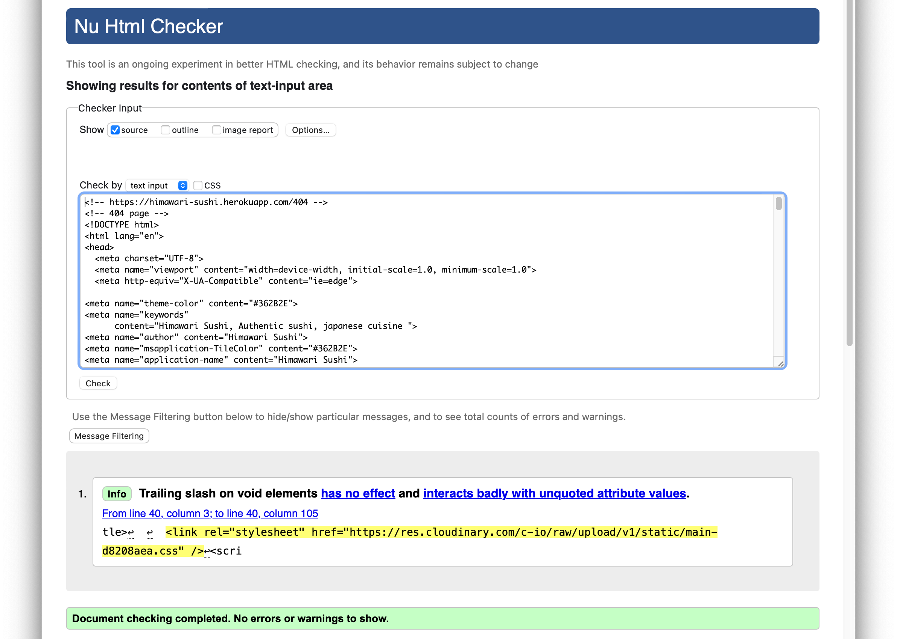                | No errors |

[🔝 Back to Top](#testing-)
